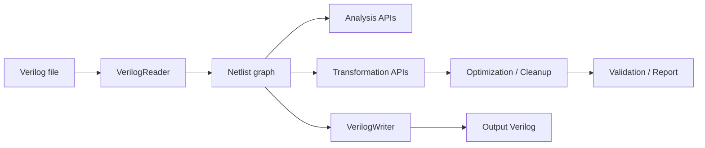

# Project Architecture

這份文件描述目前專案的整體架構。  
目標是讓新加入的人可以快速知道：資料怎麼流、每個資料夾負責什麼、主要 API 分在哪裡，以及目前測試如何驗證。

## 1. 專案目標

本專案是 ICCAD Contest Problem A 的 backend prototype。

目前核心目標：

```text
1. 讀入 restricted flattened gate-level Verilog netlist。
2. 建立內部 Netlist graph。
3. 提供 analysis API 回答 LLM / prompt 解析後的查詢。
4. 提供 transformation / optimization 的底層修改能力。
5. 逐步補上 validation / rollback / report，讓修改流程可控。
```

目前 parser / backend 的設計前提：

```text
- flattened gate-level Verilog
- single top module
- primitive gates: and/or/nand/nor/not/buf/xor/xnor
- sequential primitive: dff
- scalar / bus input output wire
- constants: 1'b0 / 1'b1
- DFF 作為 sequential boundary，組合分析不穿越 DFF
```

## 2. Top-Level Layout

```text
include/
  core/              核心資料結構與 API 宣告
  io/                Verilog reader / writer header
  lib/               第三方 library header/static library，例如 CaDiCaL

src/
  core/              Netlist construction 與基本 accessor 實作
  io/                restricted Verilog reader / writer
  analysis/          所有不修改 netlist 的查詢與分析
  transformation/    rename/reconnect/remove/insert buffer 等修改 primitive
  optimization/      cleanup/simplification pass 與 validation helper

API_SPEC/            API 規格、使用說明、team gap 文件
PROJECT_SPEC/        專案架構、分檔 ownership、整理計畫
mini test/           小型 regression test 與 mini Verilog circuit
testcase/            官方或手動測資
```

## 3. Core Data Model

主要資料結構定義在：

```text
include/core/NetlistTypes.h
include/core/Netlist.h
```

核心 graph model：

| Type | 意義 |
| --- | --- |
| `Net` | 一條實體 net / bus bit / constant net，保存 driver gate 與 load gates |
| `Gate` | 一個 primitive gate 或 DFF instance |
| `Port` | Verilog input/output port，bus port 會展開成多個 net IDs |
| `ConeResult` | transitive fanin/fanout cone 的 graph traversal 結果 |
| `Netlist` | 整個設計的 graph container 與主要 API facade |

目前 `Netlist` 使用：

```text
std::vector<Net> nets
std::vector<Gate> gates
std::unordered_map<std::string, int> netNameToId
std::unordered_map<std::string, int> gateNameToId
std::vector<Port> primaryInputs
std::vector<Port> primaryOutputs
```

ID 原則：

```text
net ID  = nets vector index
gate ID = gates vector index
```

所以 ID 查詢是 O(1) vector access，name 查詢是 hash map lookup。

## 4. Data Flow

目前主要資料流如下：



更具體地說：

```text
VerilogReader
  -> 呼叫 Netlist::addNet/addGate/addPrimaryInput/addPrimaryOutput/connectGateInput/connectGateOutput
  -> 建立 graph

Analysis API
  -> 只讀 Netlist graph
  -> 不修改 gates/nets

Transformation / Optimization
  -> 修改 Netlist graph
  -> 需要 validation / rollback 保護

VerilogWriter
  -> 從 Netlist graph 輸出 restricted Verilog
```

## 5. Header Organization

目前 header 已拆成幾個純資料型別檔案：

| Header | 負責內容 |
| --- | --- |
| `include/core/NetlistTypes.h` | `GateType`、`Net`、`Port`、`Gate`、`ConeResult` |
| `include/core/NetlistQueries.h` | Basic / Connectivity / Function / Cone query/report types |
| `include/core/PathTypes.h` | Path / Depth query/report/path endpoint types |
| `include/core/OptimizationTypes.h` | Optimization result / candidate types |
| `include/core/Netlist.h` | 主要 `Netlist` class facade 與 API 宣告 |

目前仍保留 `Netlist.h` 作為主要 include 入口。  
也就是使用者通常只需要：

```cpp
#include "include/core/Netlist.h"
```

## 6. Source Ownership

目前 `src/analysis` 已完成第一階段分檔：

| File | 負責內容 |
| --- | --- |
| `src/analysis/BasicAnalysis.cpp` | ID/name/type/count/port/basic structural issue |
| `src/analysis/ConnectivityAnalysis.cpp` | net driver/load、gate input/output、fanin/fanout |
| `src/analysis/FunctionAnalysis.cpp` | CaDiCaL SAT、equivalence、functional dependence、symmetry、always 0/1、truth status、simulation-filtered Function Search |
| `src/analysis/SequentialPatternAnalysis.cpp` | DFF D-input canonical enable/hold pattern 與 sequential semantic report |
| `src/analysis/WholeDesignEquivalence.cpp` | current/original batched SAT、PO 與 DFF.D boundary equivalence |
| `src/analysis/GraphAnalysis.cpp` | directed PI-to-PO cut 與 source-target articulation analysis |
| `src/analysis/ConeAnalysis.cpp` | transitive fanin/fanout cone、cone-local longest/shortest path |
| `src/analysis/PathAnalysis.cpp` | startpoint-to-endpoint path query 與 endpoint resolver |
| `src/analysis/DepthAnalysis.cpp` | logic depth、critical path、DepthQuery |
| `src/analysis/OptimizationAnalysis.cpp` | optimization candidate selection，不直接修改 netlist |

其他 source：

| File | 負責內容 |
| --- | --- |
| `src/core/Netlist.cpp` | construction API、name/id lookup、基本 accessor |
| `src/io/VerilogReader.cpp` | restricted Verilog parser frontend |
| `src/io/VerilogWriter.cpp` | restricted Verilog writer |
| `src/transformation/NetlistTransformation.cpp` | graph mutation primitive 與 buffer insertion |
| `src/transformation/EditFlow.cpp` | public edit validation/dispatch、transaction report 與 rollback policy |
| `src/transformation/TechMapper.cpp` | basis conversion 與 gate-type replacement |
| `src/optimization/NetlistOptimization.cpp` | cleanup/simplification pass、validation/rollback helper |

詳細 ownership 請看：

```text
PROJECT_SPEC/CPP_FUNCTION_OWNERSHIP.md
```

## 7. Analysis API Layers

目前 analysis API 分成兩層。

第一層是低階 helper：

```text
getGateId()
getNetId()
getNetDriverGateIds()
getGateFanout()
getTransitiveFaninCone()
findLongestCombinationalPath()
computeNetLevels()
...
```

第二層是內部高階 C++ query：

```text
runBasicQuery()
runDirectConnectivityQuery()
runFunctionQuery()
runFunctionSearchQuery()
runSequentialPatternQuery()
runGraphQuery()
runConeQuery()
runPathQuery()
runRegisterPathQuery()
runDepthQuery()
checkWholeDesignEquivalence()
runEditApply()
```

第三層是提供 LLM/tools 使用的公開 facade：

```text
structure_query -> runBasicQuery() / runDirectConnectivityQuery()
path_query      -> runPathQuery()，必要時使用 Graph dominator engine
其他分類 command -> 對應的高階 query/edit API
```

`runGraphQuery()` 與 `runRegisterPathQuery()` 仍保留為內部/相容入口，但不再各自占用公開 tool schema；register path 使用 PathQuery 的 `DffQ`/`DffD` endpoint preset。

高階 query 的目的：

```text
1. 給 LLM / prompt dispatch 使用。
2. 減少 prompt handler 直接呼叫大量低階 API 的風險。
3. 統一回傳 report，方便產生自然語言回答。
```

## 8. DFF Boundary Rule

目前 DFF 處理規則：

```text
- DFF 仍保存在 gates vector，type = GateType::DFF。
- DFF.Q/output net 可作為 pseudo primary input。
- DFF.D/input net 可作為 timing endpoint。
- combinational path / cone / depth analysis 不會從 DFF input 穿越到 DFF Q。
- DFF clock/reset pin 可透過 named pin helper 查詢，但目前不做 clock tree / reset tree 專用分析。
```

這個規則會影響：

```text
PathAnalysis
ConeAnalysis
DepthAnalysis
OptimizationAnalysis
```

## 9. Testing

目前小型 regression test 在：

```text
mini test/tester.cpp
mini test/mini_circuit.v
```

目前 tester 覆蓋：

```text
VerilogReader
VerilogWriter
runBasicQuery
runDirectConnectivityQuery
runFunctionQuery
runFunctionSearchQuery
runConeQuery
runPathQuery
runDepthQuery
小型 mutation primitive
```

Windows UCRT64 編譯方式：

```powershell
$sources = Get-ChildItem -Path src -Recurse -Filter *.cpp |
    Where-Object { $_.Name -notin @('MockturtleConverter.cpp', 'DepthOptimizer.cpp') } |
    ForEach-Object { $_.FullName }
g++ -std=c++20 -I. -Ilib "mini test/tester.cpp" $sources `
    -L./include/lib/cadical/win/ucrt64 -lcadical -o "mini test/tester.exe"
& ".\mini test\tester.exe"
```

目前已驗證：

```text
Summary: 45 passed, 0 failed.
Sequential pattern mini test: 15 passed, 0 failed.
Sequential edit-flow mini test: 13 passed, 0 failed.
Sequential CLI mini test: 12 passed, 0 failed.
Whole-design equivalence mini test: 9 passed, 0 failed.
```

注意：

```text
目前環境請使用 include/lib/cadical/win/ucrt64/libcadical.a。
include/lib/cadical/win/mingw64/libcadical.a 在目前 g++ runtime 下可能出現 stat64i32 linker error。
mockturtle headers 尚未配置時，focused analysis build 應暫時排除 MockturtleConverter.cpp 與 DepthOptimizer.cpp。
```

## 10. Project Spec Documents

`PROJECT_SPEC/` 目前放專案層級文件：

| File | 用途 |
| --- | --- |
| `PROJECT_ARCHITECTURE.md` | 本文件，描述整體架構 |
| `CPP_FUNCTION_OWNERSHIP.md` | 每個 `.cpp` 檔案的 function ownership |
| `PROJECT_ORGANIZATION_PLAN.md` | 後續整理與演進計畫 |

`API_SPEC/` 則保留 API 層級文件：

```text
BASIC_QUERY_API.md
DIRECT_CONNECTIVITY_QUERY_API.md
FUNCTION_ANALYSIS_API.md
CONE_QUERY_API.md
PATH_QUERY_API.md
DEPTH_ANALYSIS.md
...
```

## 11. Next Architecture Tasks

建議下一步：

```text
1. 確認 API_SPEC 與 PROJECT_SPEC 的邊界，不再混放。
2. 將 TEAM_A/B/C gap 文件中偏專案分工的內容，之後可移到 PROJECT_SPEC。
3. 設計 unified edit / optimization report，作為 transformation 與 optimization 的共同回傳格式。
4. 補 transformation / cleanup 的 mini regression test。
```
